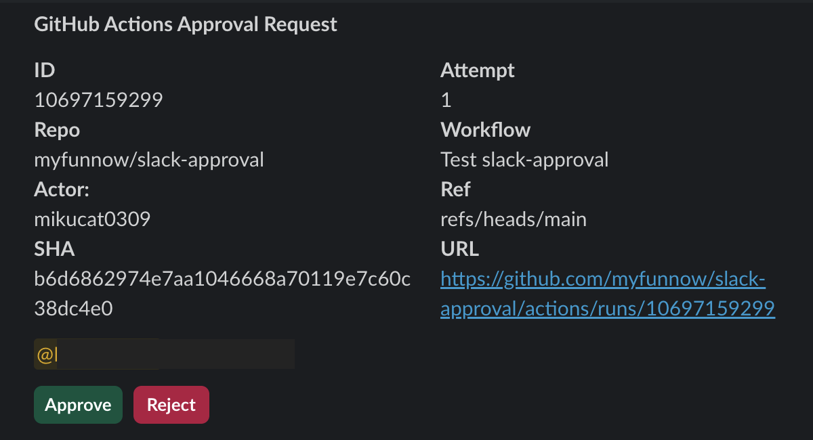

# slack-approval

Custom action to send approval request to Slack



- Post a message in Slack with a "Approve" and "Reject" buttons.
- Clicking on "Approve" will execute next steps.
- Clicking on "Reject" will cause workflow to fail.

## How To Use

- First, create a Slack App and install in your workspace.
- Second, add `chat:write` and `im:write` to OAuth Scope on OAuth & Permissions page.
- Finally, **Enable Socket Mode**.

```yml
jobs:
  approval:
    runs-on: ubuntu-latest
    steps:
      - name: send approval
        uses: Takashicc/slack-approval@main
        with:
          bot-token: ${{ secrets.SLACK_BOT_TOKEN }}
          signing-secret: ${{ secrets.SLACK_SIGNING_SECRET }}
          app-token: ${{ secrets.SLACK_APP_TOKEN }}
          channel-id: ${{ secrets.SLACK_CHANNEL_ID }}
          mention-to-user: ${{ secrets.SLACK_MENTION_TO_USER }}
          mention-to-group: ${{ secrets.SLACK_MENTION_TO_GROUP }}
          authorized-users: ${{ secrets.SLACK_AUTHORIZED_USERS }}
        timeout-minutes: 10
```

- Set args
  - `bot-token`
    - Bot-level tokens on `OAuth & Permissions page`. (starting with `xoxb-` )
  - `signing-secret`
    - Signing Secret on `Basic Information page`.
  - `app-token`
    - App-level tokens on `Basic Information page`. (starting with `xapp-` )
  - `channel-id`
    - Channel ID for which you want to send approval.
  - `mention-to-user`
    - Optional. Slack user ID to mention.
  - `mention-to-group`
    - Optional. Slack group ID to mention.
  - `authorized-users`
    - Optional. Slack user IDs who are authorized to approve or reject. Comma separated.
    - e.g.,
      - `authorized-users: xxxxxx,yyyyyy`
  - `title`
    - Required. The slack message title.
    - Default: `GitHub Actions Approval Request`

- Set `timeout-minutes`
  - Set the time to wait for approval.
